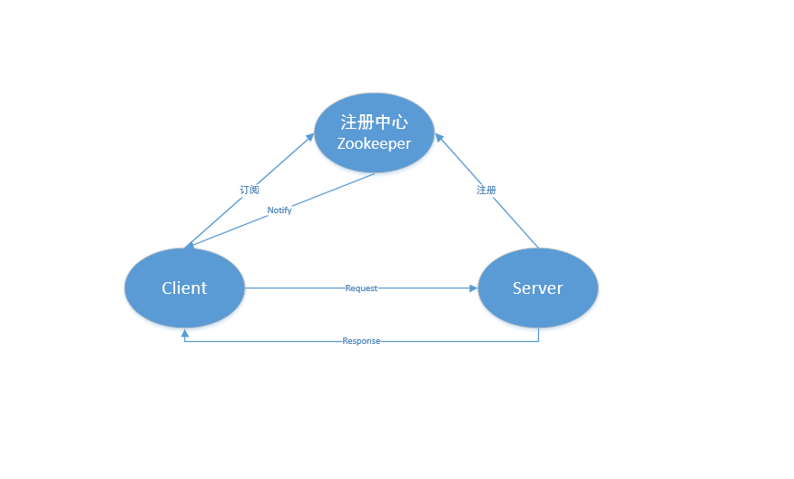

# newbie
rpc named newbie, learn from nettyRpc

### 一、整体架构

### 二、newbie rpc组成
- 注册中心
    负责存储server地址，方便client连接时能获取到需要调用接口的url
- client
    订阅注册中心，获取server url地址
- server
    发布接口服务

### 三、FAQ    
- 对比dubbo？
原理差不多，dubbo是阿里的开源rpc框架，也是基于TCP的。最近也在看dubbo的源码，希望借鉴完善newbie~

- 对比feign？
feign是基于http的, 相当于http请求调用获取结果。众所周知，http协议位于应用层，在TCP/IP四层模型中位于最上层，封装的最厉害。
四层模型由下到上分别是 数据链路层(bit)-网络层(ip)-传输层(tcp簇, udp)-应用层(http, 其他), 越接近底层越快。